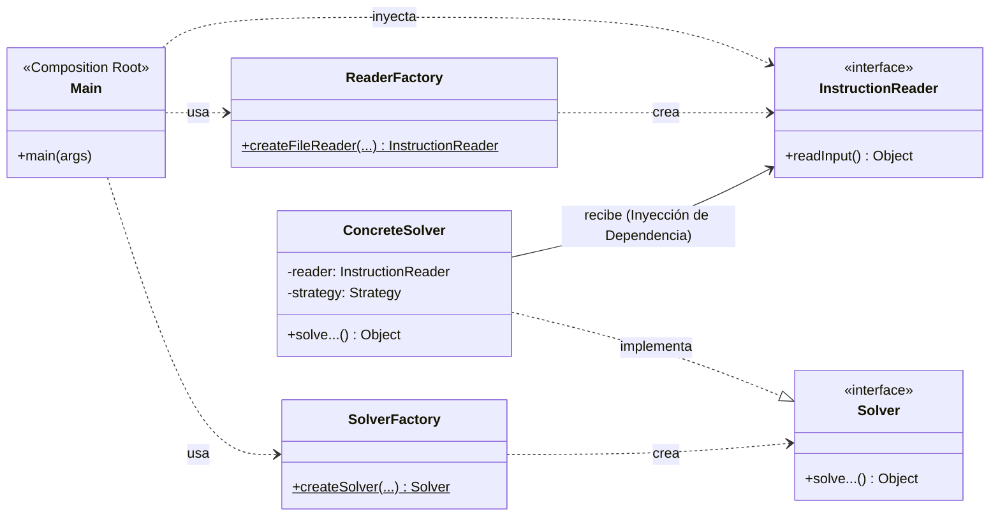
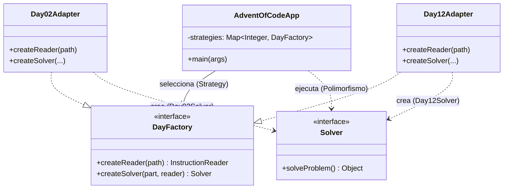

# Advent of Code 2025 🎄

Este repositorio contiene las soluciones a los desafíos de programación del [Advent of Code 2025](https://adventofcode.com/2025), desarrolladas como parte de la asignatura de **Ingeniería de Software**.

El objetivo principal de este proyecto no es solo resolver los problemas algorítmicos, sino aplicar rigurosamente **buenas prácticas de diseño y arquitectura de software**. Se ha realizado un esfuerzo de refactorización masivo para estandarizar todos los días (del 02 al 12) bajo una arquitectura común.

## Arquitectura Estandarizada

Todas las soluciones siguen un patrón arquitectónico unificado que promueve la separación de responsabilidades y la inversión de dependencias.

### Diagrama Arquitectónico Común



### Componentes Clave

1.  **Main (Composition Root):**

    - Actúa como el punto de entrada y orquestador.
    - Su única responsabilidad es crear las dependencias (usando las Factories) e inyectarlas donde sea necesario.
    - No contiene lógica de negocio.

2.  **Factories (Static):**

    - `SolverFactory` y `ReaderFactory`.
    - Métodos estáticos puros para encapsular la complejidad de la creación de objetos.
    - Centralizan la selección de estrategias (e.g., Parte A vs Parte B).

3.  **Interfaces:**

    - `Solver`: Contrato común para resolver el problema (`solve()`, `solveProblem()`). Lanza `IOException` para manejo de errores centralizado.
    - `InstructionReader`: Contrato para la lectura de datos, desacoplando la fuente (Archivo, String, Mock) del consumidor.

4.  **Inyección de Dependencias (DIP):**
    - Los `Solvers` nunca instancian sus dependencias. Reciben `InstructionReader` o estrategias auxiliares a través de su constructor.
    - El control se invierte hacia el `Main`.

## Principios Aplicados

- **Principios SOLID:** Especial énfasis en **SRP** (Responsabilidad Única) y **DIP** (Inversión de Dependencias).
- **Clean Code:** Uso de nombres semánticos y métodos pequeños.
- **Patrones de Diseño:**
  - **Factory Pattern:** Para creación de objetos.
  - **Strategy Pattern:** Para intercambiar algoritmos (Parte A/B, algoritmos de búsqueda).
  - **Decorator Pattern:** (e.g., Día 11) Para añadir funcionalidad transversal como medición de tiempo.
  - **Iterator Pattern:** Para recorrer colecciones de modelos complejos.

## Estructura del Proyecto

El código fuente se organiza en paquetes por día, ubicados en `src/main/java/software/aoc/`.

```
src/main/java/software/aoc/
├── day02/  # ...
├── ...
├── day11/  # Ejemplo de uso de Decorator y Strategy
└── day12/  # Ejemplo de arquitectura compleja con Parsers y Estrategias de Colocación
```

## Tecnologías

- **Lenguaje:** Java 17+ (Uso extensivo de `records`, `switch expressions`, `var`).
- **Gestor de Dependencias:** Maven
- **Control de Versiones:** Git

## Proyección Arquitectónica: Ejecución Unificada (Global Strategy)

Gracias a la estandarización masiva de la arquitectura en todos los días (Factories estáticas, Solvers con firmas idénticas, Readers desacoplados), el proyecto está preparado para una evolución natural: **Un ejecutor global**.

Actualmente, cada día funciona de manera aislada. Sin embargo, se podría implementar un **Patrón Strategy de Alto Nivel** para ejecutar cualquier problema desde un único punto de entrada universal.

### Implementación Propuesta

1.  **Extracción de Comunes:** Mover las interfaces `Solver` e `InstructionReader` a un paquete compartido (e.g., `software.aoc.common`).
2.  **Registro de Estrategias:** Crear un mapa o registro centralizado (`Map<Integer, DayFactory>`) que asocie el número del día con su factoría correspondiente.
3.  **Ejecución Polimórfica:** El `GlobalMain` recibiría `dia`, `parte` y `archivo` como argumentos, recuperaría la estrategia del día del mapa y ejecutaría la solución sin conocer los detalles de implementación de ese día específico.

### Diagrama de la Arquitectura Global Potencial



Esta estructura cumpliría totalmente con el **Open/Closed Principle**: para añadir un nuevo día (e.g., Día 13), solo habría que crear su paquete e implementaciones y registrar su factory en la App principal, sin modificar la lógica de ejecución existente.
