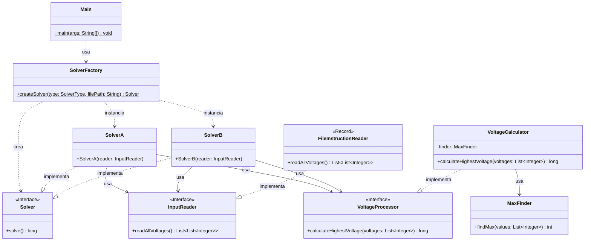

# Advent of Code 2025 - Día 3: Sistema de Gestión de Voltajes

Este proyecto contiene la solución para el **Día 3** del Advent of Code 2025. El desafío consiste en procesar reportes de voltajes para identificar valores críticos o "máximos" dentro de series de datos y calcular la suma total de estos valores procesados.

## Diseño y Arquitectura

En este proyecto se aplican estrictamente los principios SOLID y Clean Code, junto con patrones de diseño estratégicos para garantizar un código mantenible, extensible y testeable.

### 1. Principios SOLID

- **Single Responsibility Principle (SRP)**:
  - `SolverFactory`: Responsable únicamente de la creación de los objetos Solver.
  - `FileInstructionReader`: Responsable de la lectura y parseo del archivo de entrada.
  - `SolverA` / `SolverB`: Coordinan la lógica de resolución para cada parte del problema.
  - `VoltageCalculator`: Encapsula la lógica de negocio para procesar listas de voltajes.
  - `MaxFinder`: Responsable específica de encontrar valores máximos (usado por el calculador).
- **Open/Closed Principle (OCP)**:
  - El sistema es extensible mediante interfaces. Se pueden agregar nuevos tipos de `InputReader` sin modificar los Solvers.
  - Para agregar una nueva forma de procesar voltajes, basta con crear una nueva implementación de `VoltageProcessor`.
- **Liskov Substitution Principle (LSP)**:
  - `SolverA` y `SolverB` implementan la interfaz `Solver`, siendo intercambiables para el cliente (`Main`).
  - `FileInstructionReader` implementa `InputReader` y puede ser sustituido por cualquier otra fuente de datos (ej. red, base de datos) sin romper el sistema.
- **Interface Segregation Principle (ISP)**:
  - `InputReader` y `VoltageProcessor` son interfaces específicas que definen contratos claros asociados a una única funcionalidad (leer datos, procesar voltajes).
- **Dependency Inversion Principle (DIP)**:
  - Los módulos de alto nivel (`Main`, `SolverA`, `SolverB`) dependen de abstracciones (`Solver`, `InputReader`, `VoltageProcessor`), no de implementaciones concretas.

### 2. Patrones de Diseño

Se han implementado patrones de diseño para resolver problemas de creación y comportamiento:

- **Strategy Pattern (Estrategia)**:

  - La interfaz `Solver` define la estrategia de resolución del problema principal. `SolverA` y `SolverB` son estrategias concretas.
  - La interfaz `VoltageProcessor` define la estrategia para el cálculo de voltajes. `VoltageCalculator` es una implementación concreta que se inyecta en los solvers.
  - Internamente, `VoltageCalculator` utiliza `MaxFinder` como componente delegado para la lógica de búsqueda.

- **Factory Pattern (Fábrica)**:

  - `SolverFactory`: Centraliza la creación de los Solvers. Basado en un parámetro (`SolverType`), decide qué estrategia de solver instanciar e inyecta las dependencias necesarias (como el `InputReader` apropiado).

- **Dependency Injection**:
  - Las dependencias principales (`InputReader`, `VoltageProcessor`) se inyectan en los constructores de `SolverA` y `SolverB`, facilitando el testing y la flexibilidad.

### 3. Diagrama de Arquitectura

### 4. Estructura del Proyecto

La estructura de paquetes refleja la separación de responsabilidades:

- `software.aoc.day03`: Clases base, interfaces comunes y fábricas (`Solver`, `SolverFactory`, `InputReader`, `VoltageProcessor`, `FileInstructionReader`).
- `software.aoc.day03.a`: Implementación concreta para la Parte 1 (`SolverA`, `VoltageCalculator`, `MaxFinder`).
- `software.aoc.day03.b`: Implementación concreta para la Parte 2 (`SolverB`, `VoltageCalculator`, `MaxFinder`).
