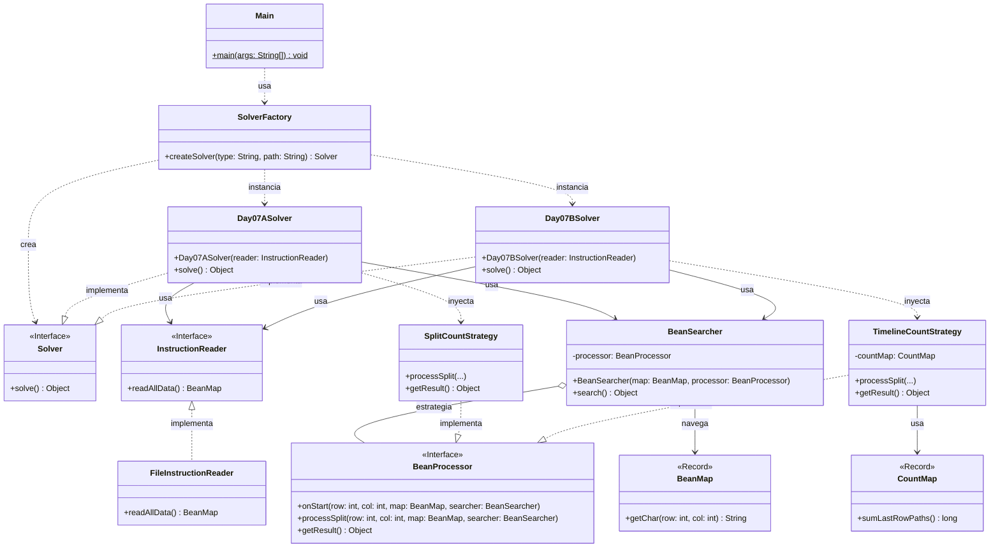

# Advent of Code 2025 - Día 7: Bean Path Traversal

Este proyecto contiene la solución para el **Día 7** del Advent of Code 2025: _Bean Path Traversal_. El desafío consiste en recorrer una estructura de mapa basada en caracteres, identificando divisiones y calculando rutas posibles, lo cual requiere un diseño flexible para manejar diferentes algoritmos de conteo sobre la misma estructura de navegación.

## Diseño y Arquitectura

En este proyecto se aplican estrictamente los principios SOLID y Clean Code, junto con patrones de diseño estratégicos para garantizar un código mantenible, extensible y testeable. Se ha optado por una arquitectura simplificada que centraliza la lógica del día en un único paquete cohesivo.

### 1. Principios SOLID

- **Single Responsibility Principle (SRP)**:
  - `SolverFactory`: Responsable únicamente de la creación de los objetos Solver adecuados según la parte del problema ("A" o "B").
  - `FileInstructionReader`: Responsable de la lectura de bajo nivel del archivo de entrada y su transformación en el mapa base.
  - `BeanSearcher`: Responsable exclusivamente de la mecánica de travesía y navegación por el mapa (moverse, encontrar nodos), delegando la lógica de negocio.
  - `SplitCountStrategy`: Contiene la lógica específica para contar divisiones en la ruta (Parte A).
  - `TimelineCountStrategy`: Contiene la lógica compleja para calcular la combinatoria de líneas de tiempo (Parte B).
  - `BeanMap`: Estructura de datos inmutable que representa el mapa de caracteres.
- **Open/Closed Principle (OCP)**:
  - El sistema es extensible para nuevas partes (ej. Parte C) implementando nuevas estrategias `BeanProcessor` sin modificar el motor de búsqueda `BeanSearcher`.
- **Liskov Substitution Principle (LSP)**:
  - `SplitCountStrategy` y `TimelineCountStrategy` implementan la interfaz `BeanProcessor`, permitiendo que `BeanSearcher` las utilice indistintamente sin conocer sus detalles.
- **Interface Segregation Principle (ISP)**:
  - `InstructionReader` define un contrato mínimo (`readAllData`), evitando dependencias innecesarias.
  - `BeanProcessor` define solo los métodos necesarios (`onStart`, `processSplit`, `processStraight`) para interactuar con la búsqueda.
- **Dependency Inversion Principle (DIP)**:
  - Los módulos de alto nivel (`BeanSearcher`) dependen de abstracciones (`BeanProcessor`), no de implementaciones concretas.
  - Los `Solver` dependen de `InstructionReader`.

### 2. Patrones de Diseño

Se han implementado patrones estándar de la industria:

- **Strategy Pattern (Estrategia)**:
  - **Nivel Dominio**: La interfaz `BeanProcessor` define la estrategia de procesamiento. `BeanSearcher` actúa como contexto, y las implementaciones como `SplitCountStrategy` aplican la lógica concreta.
  - **Nivel Aplicación**: La interfaz `Solver` permite la ejecución polimórfica de la solución.
- **Factory Pattern (Fábrica)**:
  - `SolverFactory`: Centraliza la creación de los solvers, encapsulando la decisión de qué estrategia utilizar.
  - `ReaderFactory`: Abstrae la instanciación del mecanismo de lectura.
- **Dependency Injection**:
  - Las dependencias (`BeanProcessor`, `InstructionReader`) se inyectan a través de los constructores, facilitando el testing y la modularidad.

### 3. Clean Code

- **Meaningful Names**: Nombres que revelan intención clara (`searchNumberOfSplits` vs `search`, `processSplit`).
- **Separation of Concerns**: Clara distinción entre la estructura de datos (`BeanMap`), la navegación (`BeanSearcher`) y la lógica de negocio (`Strategies`).
- **Records**: Uso de Java Records (`BeanMap`, `CountMap`, `FileInstructionReader`) para modelar datos inmutables de forma concisa.

### 4. Diagrama de Arquitectura

### 5. Estructura del Proyecto

Todos los componentes principales se encuentran bajo el paquete `software.aoc.day07`, promoviendo la cohesión y simplificando la navegación:

- **Interfaces y Factorías**: `Solver`, `InstructionReader`, `SolverFactory`, `ReaderFactory`.
- **Implementaciones de Solver**: `Day07ASolver`, `Day07BSolver`, `FileInstructionReader`.
- **Motor de Búsqueda y Estrategias**: `BeanSearcher`, `BeanProcessor`, `SplitCountStrategy`, `TimelineCountStrategy`.
- **Estructuras de Datos**: `BeanMap`, `CountMap`.
