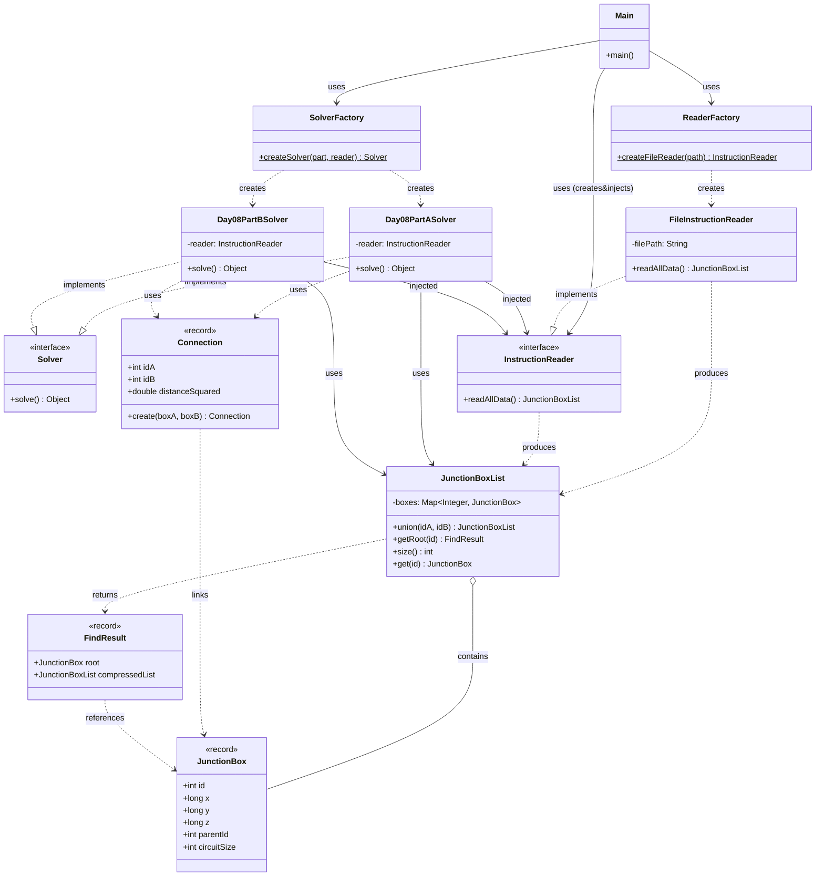

# Advent of Code 2025 - Day 8: Playground

## Descripción del Problema

El desafío consiste en ayudar a los Elfos a conectar cajas de conexiones eléctricas en un patio de juegos gigante. Se nos proporciona una lista de coordenadas 3D de estas cajas.

- **Parte 1:** Conectar los 1000 pares de cajas más cercanas y calcular el producto del tamaño de los tres circuitos resultantes más grandes.
- **Parte 2:** Continuar conectando las cajas más cercanas hasta que todas formen un único circuito gigante y calcular el producto de las coordenadas X de las dos últimas cajas conectadas.

## Arquitectura del Proyecto

El proyecto sigue una arquitectura modular estricta basada en principios SOLID y patrones de diseño. A continuación se muestra el diagrama de clases que rige la solución para ambos apartados:

### 4. Diagrama de Arquitectura

## Estructura de Paquetes

- `software.aoc.day8`: Contiene interfaces comunes (`Solver`, `InstructionReader`).
- `software.aoc.day8.a`: Implementación específica para la Parte 1.
- `software.aoc.day8.b`: Implementación específica para la Parte 2.

## Análisis de Calidad de Software (SOLID & Patrones)

### 1. Principios SOLID

#### S - Single Responsibility Principle (SRP)

Cada clase tiene una responsabilidad única y bien definida:

- `InstructionReader`: Solo se preocupa de obtener los datos.
- `Day08Solver`: Orquesta la resolución del problema usando los datos y la lógica de negocio.
- `JunctionBoxList`: Encapsula la lógica de estructuras de datos (Union-Find).
- `Factories`: Encapsulan la complejidad de la creación de objetos.

#### O - Open/Closed Principle (OCP)

El sistema está abierto a la extensión pero cerrado a la modificación. Nuevas formas de leer datos pueden añadirse creando nuevos `InstructionReader` sin modificar el `Solver`. Nuevos algoritmos de resolución pueden implementarse creando nuevos `Solver`.

#### L - Liskov Substitution Principle (LSP)

Las implementaciones de `Solver` e `InstructionReader` son intercambiables sin romper la lógica del cliente (`Main`).

#### I - Interface Segregation Principle (ISP)

Las interfaces `Solver` e `InstructionReader` son concisas y especifican solo lo necesario.

#### D - Dependency Inversion Principle (DIP)

El código de alto nivel (`Main`, `Solver`) depende de abstracciones (`Solver` interface, `InstructionReader` interface), no de implementaciones concretas.

- La inyección de dependencias (`InstructionReader` en `SolverFactory`) se coordina desde el `Main`, invirtiendo el control de creación.

### 2. Patrones de Diseño

- **Factory Pattern**: Se utilizan `SolverFactory` y `ReaderFactory` para centralizar la creación de objetos complejos. `SolverFactory` ahora recibe las dependencias necesarias.
- **Strategy Pattern**: La interfaz `Solver` actúa como una estrategia, permitiendo que `Main` ejecute cualquier implementación de resolución de problemas sin conocer los detalles internos.
- **Dependency Injection**: El `InstructionReader` se crea en `Main` y se inyecta en los Solvers a través de la fábrica, permitiendo desacoplar la obtención de datos de su procesamiento.
