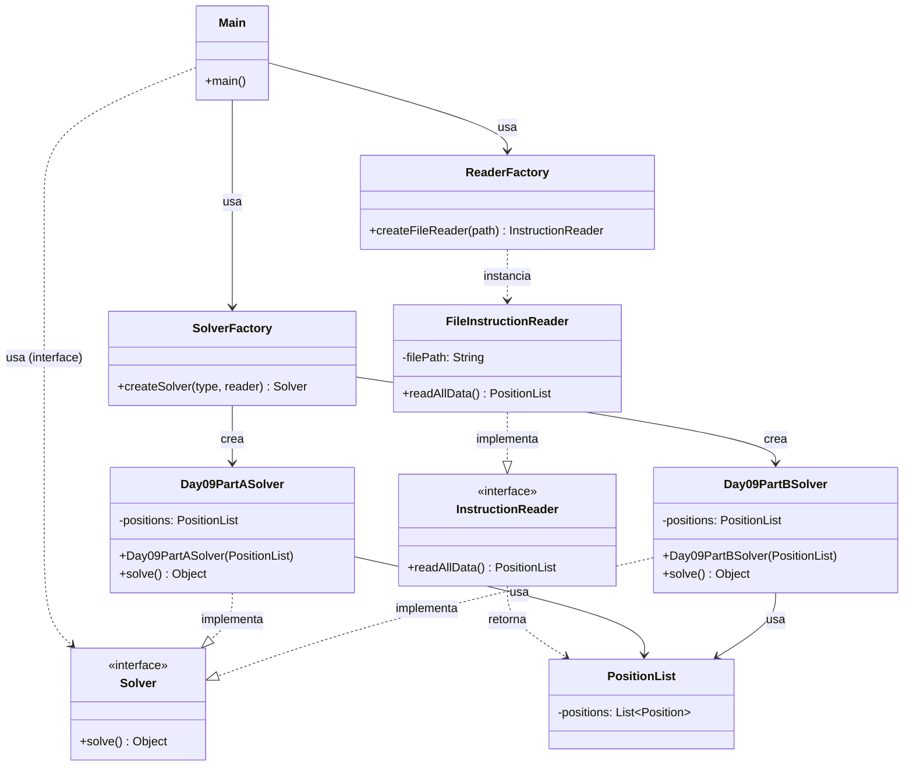

# Advent of Code 2025 - Day 9: Geometric Challenges

## Descripción del Problema

El desafío de hoy nos lleva al mundo de la geometría computacional, trabajando con coordenadas y formas geométricas.

- **Parte 1:** Dado un conjunto de coordenadas (puntos), encontrar el área del rectángulo más grande que se puede formar utilizando dos puntos cualesquiera de la lista como esquinas opuestas.
- **Parte 2:** Considerando que los puntos forman los vértices de un polígono cerrado, encontrar el área del rectángulo más grande que se puede formar con dos vértices tal que el rectángulo esté completamente contenido dentro del polígono.

## Arquitectura del Proyecto

El proyecto sigue una arquitectura modular estricta basada en principios SOLID y patrones de diseño. A continuación se muestra el diagrama de clases que rige la solución para ambos apartados:

## Estructura de Paquetes

- `software.aoc.day09`: Contiene interfaces comunes (`Solver`, `InstructionReader`), la clase principal (`Main`), factorías (`SolverFactory`, `ReaderFactory`) y modelos de dominio compartidos (`Position`, `Rectangle`, `PositionList`, `Segment`).
- `software.aoc.day09.a`: Implementación específica para la Parte 1 (`Day09PartASolver`).
- `software.aoc.day09.b`: Implementación específica para la Parte 2 (`Day09PartBSolver`, `Polygon`).

## Análisis de Calidad de Software (SOLID & Patrones)

### 1. Principios SOLID

#### S - Single Responsibility Principle (SRP)

Cada clase tiene una responsabilidad única y bien definida:

- `InstructionReader`: Solo se preocupa de obtener los datos del archivo.
- `Day09PartASolver` y `Day09PartBSolver`: Contienen únicamente la lógica algorítmica específica para cada parte del problema.
- `Rectangle` y `Polygon`: Encapsulan la lógica geométrica pura.
- `Factories`: Encapsulan la complejidad de la creación de objetos.

#### O - Open/Closed Principle (OCP)

El sistema está abierto a la extensión pero cerrado a la modificación. Nuevas partes del desafío (C, D...) pueden añadirse creando nuevos implementaciones de `Solver` y actualizando la factoría, sin modificar el código cliente en `Main` ni la lógica de lectura.

#### L - Liskov Substitution Principle (LSP)

Las implementaciones de `Solver` (`Day09PartASolver`, `Day09PartBSolver`) son completamente intercambiables desde la perspectiva del cliente (`Main`) ya que respetan el contrato de la interfaz.

#### I - Interface Segregation Principle (ISP)

Las interfaces `Solver` e `InstructionReader` son concisas y específicas. `Solver` solo requiere un método `solve()`, sin obligar a métodos innecesarios.

#### D - Dependency Inversion Principle (DIP)

El código de alto nivel (`Main`) depende de abstracciones (`Solver`, `InstructionReader`), no de las clases concretas de solución o lectura. La inyección de dependencias (o en este caso, creación controlada por factorías) permite desacoplar la lógica de control de la implementación.

### 2. Patrones de Diseño

- **Factory Pattern**: Se utilizan `SolverFactory` y `ReaderFactory` para centralizar y abstraer la lógica de creación de instancias. Esto permite que `Main` solicite un "Solver" sin preocuparse por cuál implementación específica está recibiendo.
- **Strategy Pattern**: La interfaz `Solver` actúa como una estrategia común. `Main` puede ejecutar diferentes estrategias de resolución (`PartA` vs `PartB`) de manera uniforme.
- **Record Types**: Se hace uso extensivo de `record` de Java (e.g., `Position`, `Segment`, `FileInstructionReader`) para crear objetos inmutables de datos (DTOs) de manera concisa y segura.
