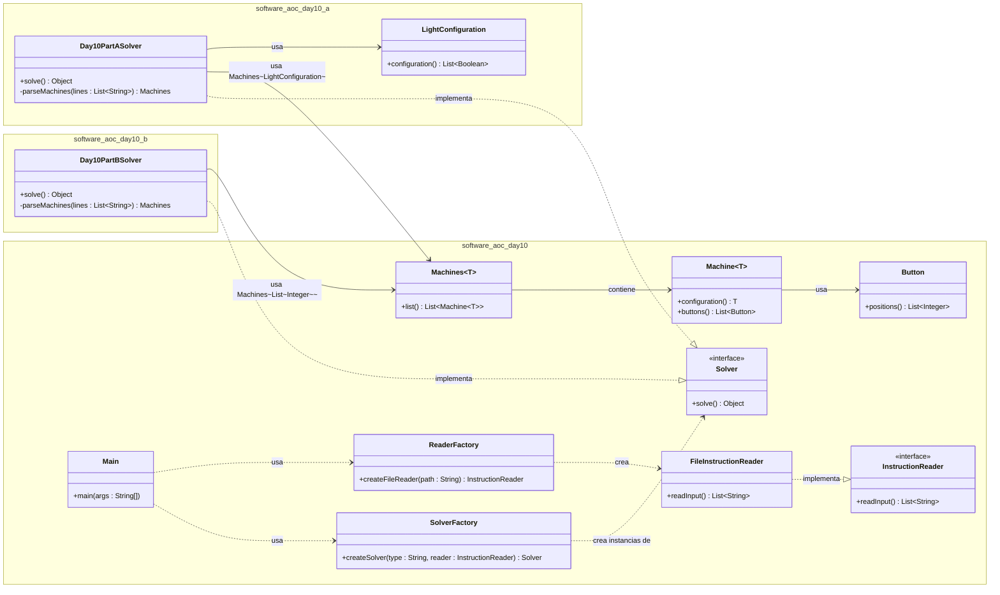

# Advent of Code 2025 - Day 10

Este proyecto resuelve el desafío del Día 10 de Advent of Code 2025 implementando una arquitectura robusta basada en **SOLID**, **Clean Code** y **Patrones de Diseño** (Factory y Strategy).

## Arquitectura del Proyecto

El código se ha refactorizado para soportar múltiples estrategias de resolución manteniendo una base común limpia y reutilizable mediante el uso de **Generics**.

### Diagrama de Clases Simplificado

### Estructura de Paquetes

- `software.aoc.day10`: **Núcleo Común**. Contiene las interfaces (`Solver`, `InstructionReader`), sus implementaciones genéricas o comunes (`FileInstructionReader`, `Machines`, `Machine`), las Factorías (`SolverFactory`, `ReaderFactory`) y el punto de entrada (`Main`).
- `software.aoc.day10.a`: **Estrategia A**. Implementación específica para la Parte 1 (Solver con lógica de parseo específica y Modelos de Configuración).
- `software.aoc.day10.b`: **Estrategia B**. Implementación específica para la Parte 2 (Solver con lógica de parseo específica).

## Patrones y Principios Aplicados

### 1. Strategy Pattern

El `Main` y `SolverFactory` permiten seleccionar dinámicamente la estrategia de resolución (`Day10PartASolver` o `Day10PartBSolver`) sin modificar la orquestación principal. Además, la lógica de **Parseo** se ha movido dentro de cada Solver, actuando como una "estrategia de interpretación" de los datos crudos.

### 2. Factory Pattern

- `ReaderFactory`: Crea una instancia de lectura de archivos simple que retorna las líneas crudas del fichero.
- `SolverFactory`: Recibe las líneas leídas y decide qué Solver instanciar, inyectando los datos necesarios.

### 3. Dependency Injection (DIP)

Los Solvers dependen de la abstracción `InstructionReader` para obtener sus datos. Esto permite que en el futuro se puedan inyectar `MockReaders` para pruebas unitarias sin tocar el código de los Solvers.

### 4. Generics y Reutilización de Código

Se ha refactorizado el modelo de datos para usar clases Genéricas (`Machines<T>` y `Machine<T>`).

- **Parte A**: Usa `Machine<LightConfiguration>`.
- **Parte B**: Usa `Machine<List<Integer>>`.
  Esto elimina la duplicidad de código que existía anteriormente teniendo clases `Machine` separadas para cada paquete.

### 5. Iterator Pattern (Iterable)

La clase contenedora `Machines<T>` implementa `Iterable<Machine<T>>`, permitiendo iterar sobre las máquinas de manera limpia y abstracta en los Solvers.

### 6. Single Responsibility Principle (SRP)

- **InstructionReader**: Su única responsabilidad ahora es I/O (leer lineas del disco). No sabe nada de la lógica del dominio.
- **Solvers**: Son responsables de interpretar (parsear) esas líneas según las reglas de su parte específica (A o B) y ejecutar el algoritmo de solución.
