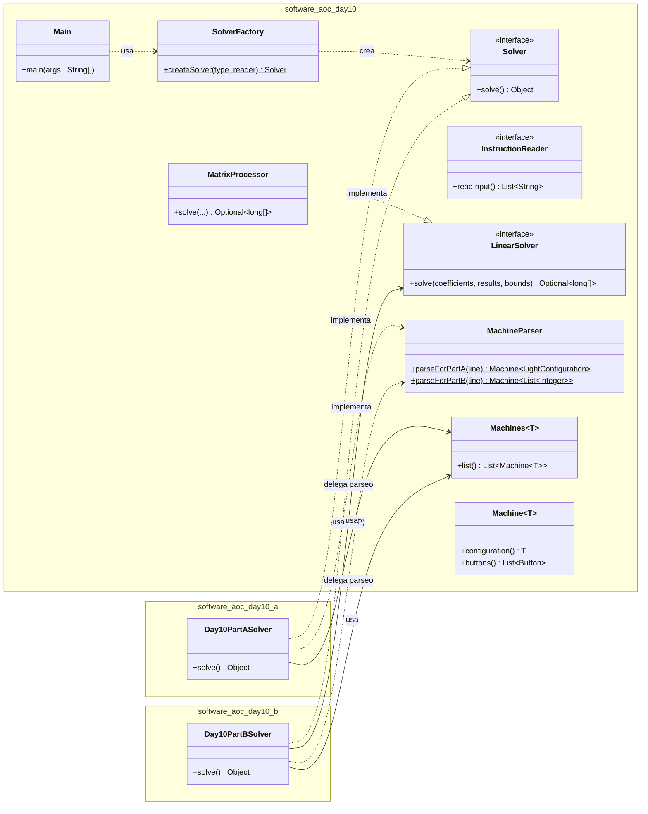

# Advent of Code 2025 - Day 10

Este proyecto resuelve el desafío del Día 10 de Advent of Code 2025 implementando una arquitectura robusta basada en **SOLID**, **Clean Code** y **Patrones de Diseño**.

## Arquitectura del Proyecto

El código se ha refactorizado para soportar múltiples estrategias de resolución manteniendo una base común limpia. Se ha puesto especial énfasis en separar el **Dominio** (Máquinas, Botones), el **Parsing** (Conversión de Texto) y las **Matemáticas** (Álgebra Lineal).

### Diagrama de Clases Simplificado

## Patrones y Principios Aplicados

### 1. Inversión de Dependencias (DIP) y Contratos

Se ha introducido la interfaz `LinearSolver` para aislar la lógica matemática compleja.

- **El Contrato**: `LinearSolver` define _qué_ hace el sistema (resolver un sistema lineal), sin especificar _cómo_.
- **La Implementación**: `MatrixProcessor` implementa este contrato usando Eliminación Gaussiana.
- **El Beneficio**: `Day10PartBSolver` solo sabe que necesita resolver un sistema, no le importa si es Gauss, Cramer o Magia.

### 2. Factory Pattern & Static Factory

- **`MachineParser`**: Actúa como una Factoría Estática especializada que encapsula toda la lógica de transformación de Texto a Objetos (`String` -> `Machine`). Esto limpia los Solvers de expresiones regulares y manejo de cadenas "sucias".
- **`SolverFactory`**: Centraliza la creación de solvers.

### 3. Single Responsibility Principle (SRP)

Cada clase tiene una única razón para cambiar:

- **`MachineParser`**: Solo cambia si cambia el formato del archivo de entrada.
- **`MatrixProcessor`**: Solo cambia si cambiamos el algoritmo matemático (ej. optimizar Gauss).
- **`Day10PartBSolver`**: Solo cambia si cambian las reglas del puzzle (cómo interpretar la solución o calcular el costo).
- **`InstructionReader`**: Solo cambia si cambia el origen de los datos (Archivo vs API).

### 4. Generics

Uso de `Machine<T>` para reutilizar la estructura de datos entre la Parte A (Configuración de Luces) y la Parte B (Listas de Enteros).
