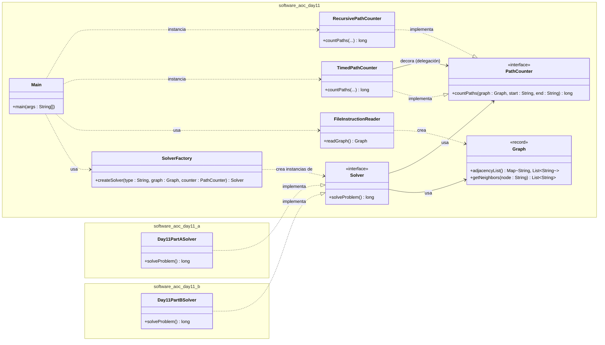

# Advent of Code 2025 - Day 11

Este proyecto resuelve el desafío del Día 11 de Advent of Code 2025 implementando una arquitectura robusta basada en **SOLID**, **Clean Code** y **Patrones de Diseño** (Factory, Strategy, Decorator).

## Arquitectura del Proyecto

El código se ha refactorizado para soportar múltiples estrategias de resolución manteniendo una base común limpia y reutilizable, separando claramente la lógica de parsing, el grafo y el algoritmo de búsqueda.

### Diagrama de Clases Simplificado

### Estructura de Paquetes

- `software.aoc.day11`: **Núcleo Común**. Contiene las interfaces (`Solver`, `PathCounter`), implementaciones genéricas (`RecursivePathCounter`, `TimedPathCounter`), modelos (`Graph`, `FileInstructionReader`), la Factoría (`SolverFactory`) y el punto de entrada (`Main`).
- `software.aoc.day11.a`: **Estrategia A**. Implementación específica para la Parte 1 (`Day11PartASolver`).
- `software.aoc.day11.b`: **Estrategia B**. Implementación específica para la Parte 2 (`Day11PartBSolver`).

## Patrones y Principios Aplicados

### 1. Strategy Pattern

- **Solver**: Permitimos seleccionar dinámicamente la estrategia de resolución (`Day11PartASolver` o `Day11PartBSolver`) a través del `SolverFactory`.
- **PathCounter**: La lógica de conteo de caminos se encapsula en una estrategia (`PathCounter`). Aunque actualmente usamos `RecursivePathCounter`, podríamos cambiarla por una iterativa sin afectar a los Solvers.

### 2. Factory Pattern

- `SolverFactory`: Centraliza la creación de los objetos `Solver`. Recibe el grafo y el contador de caminos ya instanciados y devuelve el resolvedor adecuado (A o B) según la entrada.

### 3. Decorator Pattern

- `TimedPathCounter`: Implementa el patrón Decorator sobre `PathCounter`. Envuelve una implementación concreta (como `RecursivePathCounter`) para añadir funcionalidad de medición de tiempo sin modificar la lógica original del algoritmo.

### 4. Dependency Injection (DIP)

Los `Solvers` no crean sus propias dependencias. Reciben el `Graph` y el `PathCounter` a través de su constructor. Esto reduce el acoplamiento y facilita el testeo.

### 5. Single Responsibility Principle (SRP)

- **FileInstructionReader**: Se encarga únicamente de leer el archivo y construir el grafo.
- **PathCounter**: Se encarga únicamente del algoritmo de búsqueda de caminos.
- **Solver**: Se encarga de orquestar la resolución del problema específico de cada parte, usando el grafo y el contador.
- **Main**: Se encarga de la configuración inicial y la inyección de dependencias.
