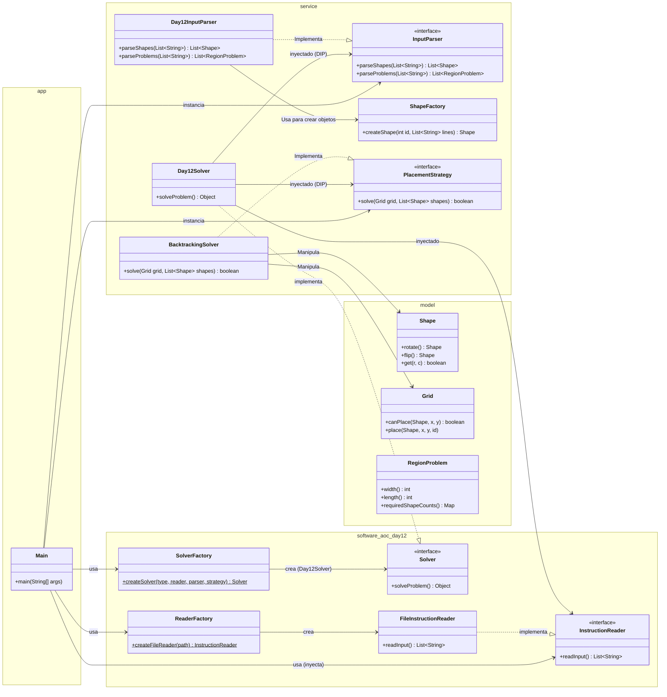

# Advent of Code 2025 - Day 12

Este proyecto resuelve el desafío del Día 12 de Advent of Code 2025 implementando una arquitectura modular basada en **SOLID**, **Clean Code** y **Patrones de Diseño**.

## Arquitectura del Proyecto

El sistema divide claramente las responsabilidades entre la orquestación (App), la lógica de negocio (Service) y los datos (Model). Se ha puesto énfasis en la **Inversión de Dependencias** y la **Responsabilidad Única**.

### Diagrama de Clases

## Estructura de Paquetes

- `software.aoc.day12`: **Núcleo Común**. Contiene las interfaces (`Solver`, `InstructionReader`), sus implementaciones/factorías (`FileInstructionReader`, `SolverFactory`, `ReaderFactory`).
- `software.aoc.day12.app`: Contiene el **Punto de Entrada**. `Main` actúa como **Composition Root**, orquestando la creación de dependencias.
- `software.aoc.day12.service`: Contiene la lógica de negocio, interfaces de servicio, el resolvedor principal `Day12Solver` (que implementa `Solver`), factorías y estrategias.
- `software.aoc.day12.model`: Contiene los objetos de dominio puros (`Shape`, `Grid`, `RegionProblem`).

## Patrones y Principios Aplicados

### 1. Composition Root y Dependency Injection

`Main` orquesta toda la creación de dependencias, inyectando `InstructionReader`, `InputParser` y `PlacementStrategy` en el `Solver` a través de la `SolverFactory`.

### 2. Strategy Pattern

Se define `PlacementStrategy` para intercambiar algoritmos de resolución (e.g., Backtracking vs DLX). `SolverFactory` recibe la estrategia a utilizar.

### 3. Factory Pattern

- **ReaderFactory**: Centraliza la creación del lector.
- **SolverFactory**: Centraliza la creación del Solver.
- **ShapeFactory**: Encapsula el parseo de formas.

### 4. Single Responsibility Principle (SRP)

- **InstructionReader**: Solo IO.
- **InputParser**: Solo estructura datos.
- **Day12Solver**: Solo coordina (lee, parsea, delega resolución).
- **BacktrackingSolver**: Solo resuelve.

### 5. Dependency Inversion Principle (DIP)

`Day12Solver` depende de abstracciones (`InstructionReader`, `InputParser`, `PlacementStrategy`) inyectadas desde fuera, no de concreciones.
