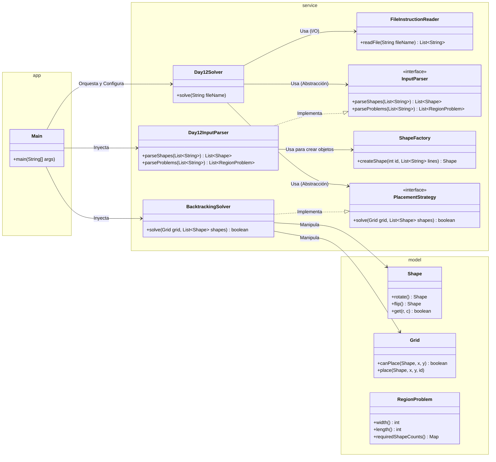

# Advent of Code 2025 - Day 12

Este proyecto resuelve el desafío del Día 12 de Advent of Code 2025 implementando una arquitectura modular basada en **SOLID**, **Clean Code** y **Patrones de Diseño**.

## Arquitectura del Proyecto

El sistema divide claramente las responsabilidades entre la orquestación (App), la lógica de negocio (Service) y los datos (Model). Se ha puesto énfasis en la **Inversión de Dependencias** y la **Responsabilidad Única**.

### Diagrama de Clases

## Estructura de Paquetes

- `software.aoc.day12.app`: Contiene el **Punto de Entrada**. `Main` actúa como **Composition Root**, configurando todas las dependencias antes de iniciar la ejecución.
- `software.aoc.day12.service`: Contiene la lógica de negocio, interfaces de servicio, el orquestador `Day12Solver`, factorías y estrategias.
- `software.aoc.day12.model`: Contiene los objetos de dominio puros (`Shape`, `Grid`, `RegionProblem`) que encapsulan el estado y comportamiento básico de los datos.

## Patrones y Principios Aplicados

### 1. Composition Root (Inversión de Control)

La clase `Main` no contiene lógica de negocio. Su única responsabilidad es instanciar las implementaciones concretas (`BacktrackingSolver`, `Day12InputParser`) e inyectarlas en el orquestador principal (`Day12Solver`). Esto facilita el testing y el cambio de implementaciones.

### 2. Strategy Pattern

Se define la interfaz `PlacementStrategy`. Actualmente usamos `BacktrackingSolver`, pero esta abstracción permitiría cambiar fácilmente a un algoritmo más complejo (como "Dancing Links" - Algorithm X) sin modificar el orquestador ni el resto del sistema.

### 3. Factory Pattern

`ShapeFactory` encapsula la lógica compleja de convertir una lista de cadenas de caracteres (el input crudo) en un objeto `Shape` válido e inmutable. Esto limpia el parser y centraliza la creación de objetos.

### 4. Single Responsibility Principle (SRP)

- **FileInstructionReader**: Solo sabe leer ficheros.
- **InputParser**: Solo sabe transformar texto en objetos.
- **Day12Solver**: Solo sabe coordinar el flujo de ejecución.
- **BacktrackingSolver**: Solo sabe resolver el puzzle algorítmico.

### 5. Dependency Inversion Principle (DIP)

El `Day12Solver` (módulo de alto nivel) no depende de las clases concretas de bajo nivel (`BacktrackingSolver` o `Day12InputParser`), sino de sus abstracciones (`PlacementStrategy` e `InputParser`).
